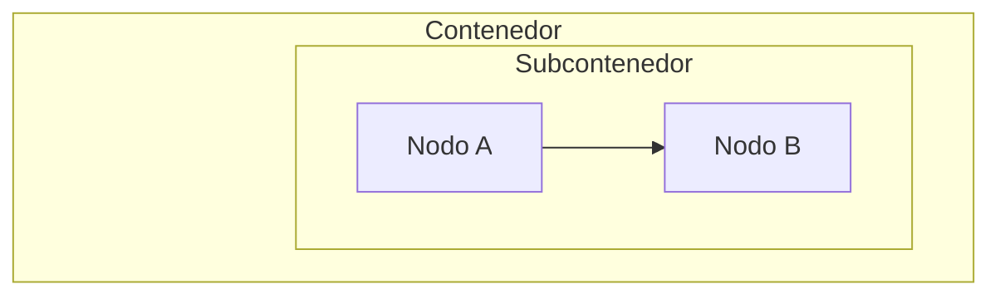

# Mermaid Diagram Skill

Genera diagramas Mermaid correctos y consistentes aplicando estándares técnicos validados.

## Proceso de Generación

1. **Identificar tipo** → ¿Qué comunica el diagrama? (ver tabla de tipos)
2. **Seleccionar plantilla** → Cargar desde `assets/` según tipo
3. **Aplicar colores** → Formato obligatorio según tipo de diagrama
4. **Validar** → Ejecutar checklist pre-renderizado
5. **Entregar** → Bloque ` ```mermaid ` listo para copiar

## Tipos de Diagrama — Cuándo Usar Cada Uno

| Tipo | Declaración | Usa cuando... |
|------|-------------|---------------|
| Sequence | `sequenceDiagram` | Interacciones entre componentes/servicios/actores |
| Flowchart | `graph TD` / `flowchart TD` | Flujos de decisión, procesos, pipelines |
| State | `stateDiagram-v2` | Estados y transiciones del sistema |
| C4 | `C4Component` | Arquitectura de componentes estilo C4 |

## Reglas Críticas (Anti-Errores)

### 🚫 HTML Prohibido
NUNCA usar `<span>`, `<b>`, `<div>`, `<br>`. Usar Markdown: `**texto**` para negritas.

### 🎨 Formato de Color por Tipo
- **Flowchart/State → HEX con Alpha:** `style Nodo fill:#0096FF26,stroke:#0096FF,color:#fff`
- **Sequence → RGBA:** `rect rgba(0, 150, 255, 0.15)`

### 🌓 Transparencia 0.15
SIEMPRE usar transparencia 0.15 en fondos para compatibilidad dark/light mode.

### ✏️ Color de Texto
SIEMPRE incluir `color:#fff` en estilos de flowchart para legibilidad.

## Paleta de Colores Estándar

| Color | Uso | HEX (Flowchart) | RGBA (Sequence) |
|-------|-----|-----------------|-----------------|
| Azul | App/Build/Procesos | `#0096FF26` | `rgba(0, 150, 255, 0.15)` |
| Naranja | Mid/Storage | `#FFA50026` | `rgba(255, 165, 0, 0.15)` |
| Verde | Red/Deploy/Éxito | `#00FF7F26` | `rgba(0, 255, 127, 0.15)` |
| Rosa | Sec/Auth/Seguridad | `#FF69B426` | `rgba(255, 105, 180, 0.15)` |
| Rojo | Error/Crítico | `#FF000026` | `rgba(255, 0, 0, 0.15)` |

## Subgraphs Anidados — Técnica Nodo Fantasma

Cuando hay subgraphs dentro de subgraphs, aplicar esta técnica para evitar superposición de títulos:



## Validación Pre-Renderizado

Antes de entregar el diagrama, verificar:
- [ ] No contiene etiquetas HTML
- [ ] Formato de color correcto según tipo (HEX vs RGBA)
- [ ] Transparencia 0.15 en todos los fondos
- [ ] `color:#fff` en estilos de flowchart
- [ ] Si hay subgraphs anidados → Técnica Nodo Fantasma aplicada

## Gotchas

- `rgba()` **ROMPE** flowcharts — siempre usar HEX con alpha (`#RRGGBBAA`)
- Los bloques `rect` en sequence diagrams SÍ soportan `rgba()`
- Sin `color:#fff` el texto desaparece sobre fondos de color
- GitHub, GitLab, Azure DevOps y Notion soportan Mermaid nativamente
- VS Code requiere extensión para preview

## Referencias Detalladas

Para reglas completas, ejemplos extendidos y validaciones post-renderizado, consultar `references/rules.md`.
