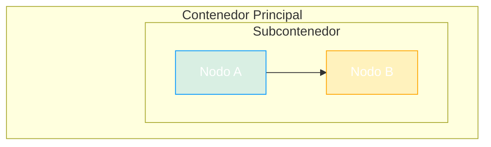

```mermaid
graph TD
    classDef spacer fill:none,stroke:none,height:0px;
    subgraph Padre["Contenedor Principal"]
        sep[ ]:::spacer
        sep ~~~ HijoA
        subgraph Hijo["Subcontenedor"]
            HijoA[Nodo A]
            HijoB[Nodo B]
            HijoA --> HijoB
        end
    end
    style HijoA fill:#0096FF26,stroke:#0096FF,color:#fff
    style HijoB fill:#FFA50026,stroke:#FFA500,color:#fff
```
