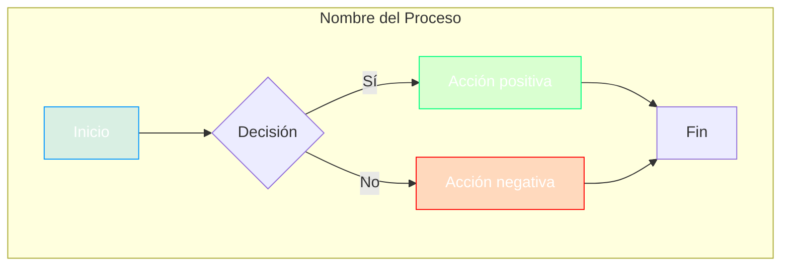

```mermaid
graph TD
    subgraph Proceso["Nombre del Proceso"]
        A[Inicio] --> B{Decisión}
        B -->|Sí| C[Acción positiva]
        B -->|No| D[Acción negativa]
        C --> E[Fin]
        D --> E
    end
    style A fill:#0096FF26,stroke:#0096FF,color:#fff
    style C fill:#00FF7F26,stroke:#00FF7F,color:#fff
    style D fill:#FF000026,stroke:#FF0000,color:#fff
```
