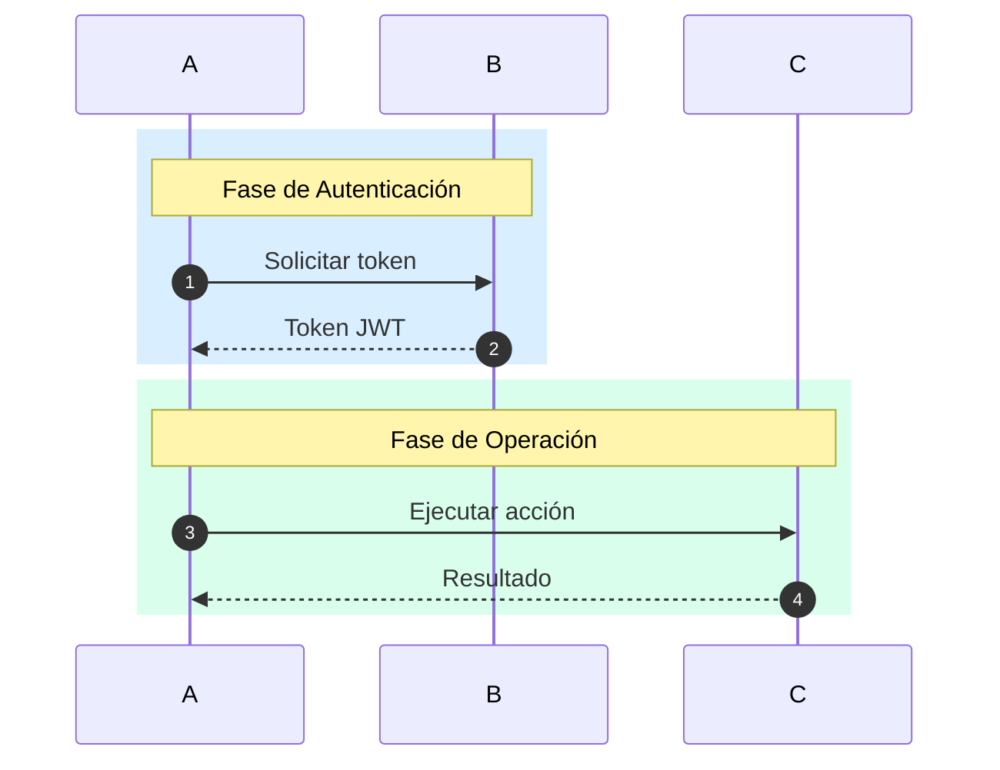
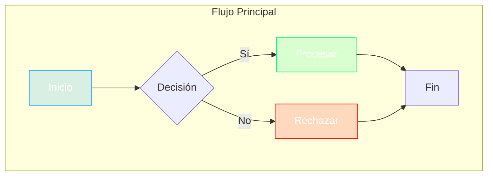
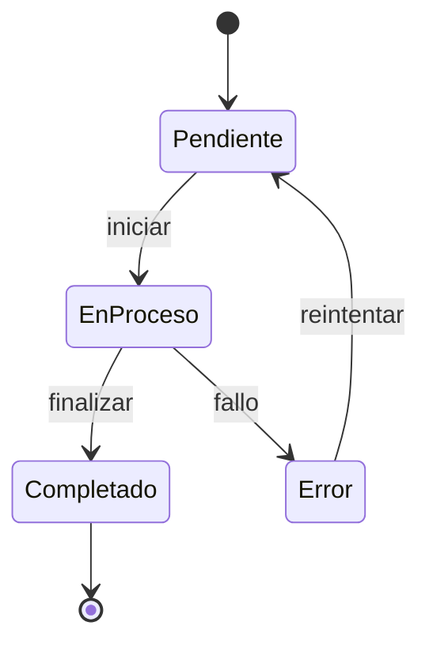
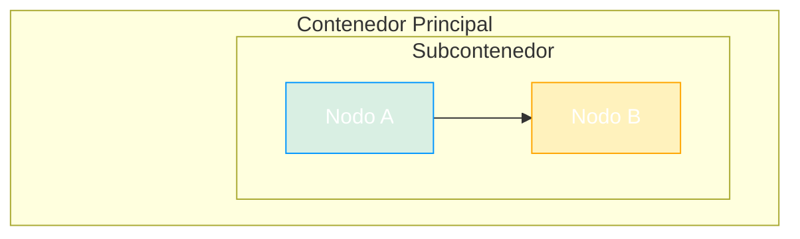

# Reglas Detalladas MermaidJS

Referencia completa de estándares técnicos y visuales para diagramas Mermaid.

## Proceso de Generación (8 Pasos)

1. Validar tipo de diagrama (sequence, flowchart, state, c4)
2. Seleccionar tipo según contexto del usuario
3. Validar ausencia de HTML prohibido
4. Aplicar formato de color según tipo
5. Seleccionar colores por propósito (paleta estándar)
6. Aplicar reglas específicas del tipo de diagrama
7. Si subgraphs anidados → aplicar técnica Nodo Fantasma
8. Ejecutar validaciones pre-renderizado

## Paleta de Colores Completa

```yaml
azul:
  uso: "App/Build/Procesos"
  hex: "#0096FF26"
  rgba: "rgba(0, 150, 255, 0.15)"

naranja:
  uso: "Mid/Storage/Almacenamiento"
  hex: "#FFA50026"
  rgba: "rgba(255, 165, 0, 0.15)"

verde:
  uso: "Red/Deploy/Éxito"
  hex: "#00FF7F26"
  rgba: "rgba(0, 255, 127, 0.15)"

rosa:
  uso: "Sec/Auth/Seguridad"
  hex: "#FF69B426"
  rgba: "rgba(255, 105, 180, 0.15)"

rojo:
  uso: "Error/Crítico"
  hex: "#FF000026"
  rgba: "rgba(255, 0, 0, 0.15)"
```

## Reglas Críticas Anti-Errores

### HTML Prohibido

Evitar etiquetas HTML que rompen el renderizado.

**Prohibido:**
- `<span>`, `<span style=...>`
- `<b>`
- `<div>`
- `<br>`

**Alternativa:** Usar sintaxis Markdown estándar (`**texto**` para negritas)

**Ejemplo incorrecto:** `<b>Texto importante</b>`
**Ejemplo correcto:** `**Texto importante**`

### Colores por Tipo

El formato de color depende del tipo de diagrama:

**Flowchart:**
- Formato requerido: HEX con Alpha (`#RRGGBBAA`)
- Formato prohibido: `rgba()` — causa error de sintaxis
- Ejemplo correcto: `style Nodo fill:#0096FF26,stroke:#0096FF,color:#fff`
- Ejemplo incorrecto: `style Nodo fill:rgba(0, 150, 255, 0.15)`

**Sequence:**
- Formato requerido: RGBA
- Los bloques `rect` en sequence sí soportan `rgba()`
- Ejemplo correcto: `rect rgba(0, 150, 255, 0.15)`

## Tipos de Diagrama — Reglas Específicas

### Sequence Diagram

**Declaración:** `sequenceDiagram`
**Cuando usar:** Interacciones entre componentes/servicios/actores

**Reglas:**
- Usar `autonumber` (obligatorio) — numera automáticamente los mensajes
- Agrupar fases con bloques `rect` (opcional) — mejora legibilidad visual
- Usar formato RGBA para colores (obligatorio)

**Ejemplo completo:**



### Flowchart

**Declaración:** `graph TD` | `graph LR` | `flowchart TD` | `flowchart LR`
**Cuando usar:** Flujos de decisión, procesos, pipelines

**Reglas:**
- Usar `subgraph` para agrupar (opcional)
- Usar HEX con Alpha para estilos (obligatorio)
- Añadir `color:#fff` para legibilidad (obligatorio)

**Ejemplo completo:**



### State Diagram

**Declaración:** `stateDiagram-v2`
**Cuando usar:** Estados y transiciones del sistema

**Reglas:**
- Usar HEX con Alpha para estilos (igual que flowchart)

**Ejemplo completo:**



### C4 Component

**Declaración:** `C4Component`
**Cuando usar:** Arquitectura de componentes estilo C4

**Reglas:**
- Definir contenedores y componentes (obligatorio)
- Usar relaciones claras (obligatorio)

## Técnica Nodo Fantasma (Subgraphs Anidados)

**Problema:** Los títulos de subgraphs anidados se superponen visualmente
**Obligatorio cuando:** Se usan subgraphs dentro de otros subgraphs

**Pasos:**
1. Definir clase spacer al inicio: `classDef spacer fill:none,stroke:none,height:0px;`
2. Crear nodo vacío dentro del subgraph padre: `sep[ ]:::spacer`
3. Forzar posición con link invisible: `sep ~~~ NodoDelHijo`

**Ejemplo completo:**



## Compatibilidad y Renderizado

**Dark/Light Mode:** Usar transparencia 0.15 en todos los colores de fondo para asegurar visibilidad en ambos modos.

**Renderizadores soportados:**
- GitHub Markdown (nativo)
- VS Code Preview (requiere extensión Mermaid)
- Mermaid Live Editor (https://mermaid.live)
- GitLab (nativo)
- Notion (bloques de código)
- Azure DevOps Wiki (nativo)

## Validaciones

### Pre-Renderizado
- Verificar que no existan etiquetas HTML (`<span`, `<div`, `<b>`, `<br>`)
- Confirmar formato de color según tipo (flowchart: HEX, sequence: RGBA)
- Validar sintaxis de subgraphs anidados (Técnica Nodo Fantasma si hay anidación)

### Post-Renderizado
- Verificar legibilidad de texto sobre fondos de color
- Confirmar que los colores se muestran correctamente
- Validar que no hay superposición de elementos
- Probar en dark mode y light mode

## Resumen Rápido — Reglas de Oro

1. 🚫 NUNCA usar HTML (`<span>`, `<b>`, `<div>`, `<br>`)
2. 🎨 Flowchart/State → HEX (`#RRGGBBAA`)
3. 🎨 Sequence → RGBA (`rgba(R,G,B,0.15)`)
4. 📦 Subgraphs anidados → Técnica Nodo Fantasma
5. 🌓 Siempre transparencia 0.15 para dark/light mode
6. ✏️ Siempre `color:#fff` en estilos para legibilidad
